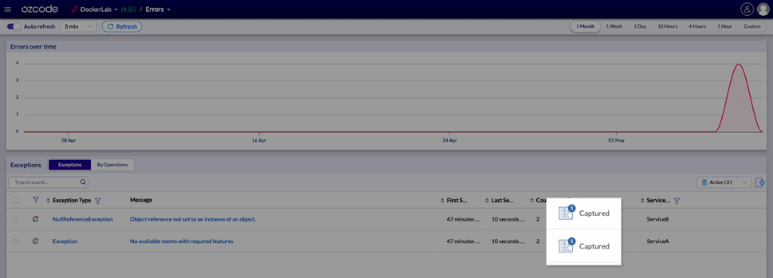
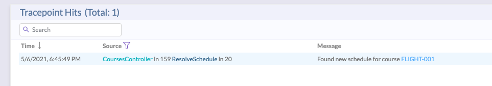

# Night School - Docker Lab
A lab showing how to use Ozcode Live Debugger to troubleshoot production errors in Docker microservices  

## Getting started

### Step 1: Clone our Docker demo
```bash
git clone https://github.com/oz-code/Nightschool-DockerLab
cd Nightschool-DockerLab
```
This is small repo that includes a docker-compose YAML file that runs several microservices written in .NET Core 3.1. All microservices have the Ozcode Live Debugger agent installed and are ready to go. All you have to do is supply the Ozcode agent token as described in the next section.

### Step 2: Register to Ozcode Live Debugger
1. Go to https://app.oz-code.com/sign-up-check and register a new account
2. Create an application called "DockerLab"

3. When presented with options for Platform, OS, and Deployment, select **My Host**, **Linux**, and **Docker**. 

4. Scroll down in the Docker installation instructions and find ```OzCode_Agent_Token``` value

5. Edit the ```.env``` file in the **Nighschool-DockerLab** folder you cloned and enter your token in the corresponding variable.


### Step 3: Run the example
```bash
docker-compose up
```
This should download several images from Docker Hub and start your local cluster.


## Demo Structure
The demo is composed of the following Docker microservices:

| Service | Tech | Address | Description |
|--|--|--|--|
| ServiceA | .Net Core 3.1 Web.API | http://localhost:5001 | Manages course schedules
| ServiceB | .Net Core 3.1 Web.API | http://localhost:5002 | Manages room allocations
| ServiceAuth | .Net Core 3.1 Web.API | http://localhost:5003 | Manages authentication and token generation
| ServiceUI | .Net Core 3.1 Razor pages | http://localhost:5000 | UI service
| ServiceSPA | Node.JS Vue | http://localhost:5080 | UI service SPA generates traffic and errors in the cluster
| SEQ | SEQ | http://localhost:5050 | Log aggregation

We will use Service SPA to generate some traffic and errors our cluster. Using Ozcode Live Debugger we will capture errors and add tracepoints to troubleshoot issues.

# Lab Structure

There are two main parts to this lab:

 1. Debugging an error that generates an exception
 2. Debugging a logical error with tracepoints and dynamic logging

## Exercise 1: Debugging an error that generates an exception 

### 1.1 Generate the error
1. Navigate to http://localhost:5080 to see the main screen of the application.

2. Click on the ```Courses``` tab to see all available courses. None of them are scheduled yet. 

3. Click the ```Schedule``` button for course ```INTRO-001``. The application will create a schedule for the course, and the record will turn green.
4. Do the same for course ```LEGAL-001```. It, too, will turn green. Amazing!
5. Now try to create a schedule for ```HAND-001```. This will generate an error, and an alert will pop up. 

Click OK to dismiss the alert.

### 1.2 Capturing the exception
1. Go back to Ozcode’s live debugger (at http://app.oz-code.com/) and click the Ozcode logo in the top left corner to view the Exception Dashboard. You should see two exceptions in ```Capturing``` mode (you may need to ``Refresh``  to reload errors). 

2. Back in the Night School application, generate the bug again by clicking the ```Schedule``` button for ```HAND-001```.
3. Refresh the Ozcode dashboard, and you should see that the exceptions are now in a ``Captured`` state. 

Select one of the exceptions and click ``Debug``. You should now see the ``Debug`` screen showing the primary debug information for this exception.


### 1.3 Capturing full time-travel information
1. Click the ``Full Capture`` button at the top of the Debug screen
2. Now go back to the Night School application and once again click the ``Schedule`` button for ``HAND-001``. As expected (errors don’t just fix themselves), you will see the alert again.
3.  In Ozcode, go back to the Exception Dashboard. The Status column for the exception should now indicate ``Fully Captured``. Select the exception, and click ``Debug`` again.

**INFO:** The exception whose message is “No available rooms with required features” is the best one to see time-travel debug features.

## Exercise 2: Debugging a Logical Error with Tracepoints and Dynamic Logging

### 2.1 Generate the logical error
NOTE: For this exercise to work, you must first complete Exercise 1.

1. After completing Exercise 1, both ``INTRO-001`` and ``LEGAL-001`` should have courses scheduled. If this is not the case, please restart your cluster and redo Exercise 1.
2. To generate a logical error, go back to the Night School application and try to schedule rooms for `FLIGHT-001`. The row for that course will be highlighted in yellow to indicate a problem with scheduling. You’ll see that rooms were assigned, but no students were registered.


### 2.2 Create a tracepoint session for debugging
1. In the Ozcode dashboard, select `Tracepoint Sessions`.

2. In the Tracepoints screen, click Create in the top right corner and give your session a name.
3.  In the `Code  Explorer` panel, drill down into `ServiceA` to find class `ServiceA. Controllers.CoursesController`.  
4. Select function `ResolveSchedule`.
5. In the `Code` panel, click to the left of the line that says `course.Schedule = newSchedule;` to add a tracepoint.
6. Add the following message to the tracepoint
   ```
   Found new schedule for course {id}
   ```

7. Click the green tick to set the tracepoint.
8. Click `Start Collecting` in the top right corner of the screen
9. Go back to the Night School application and once again, click `Schedule` for `FLIGHT-001`
10.  Back in Ozcode, you should now see a tracepoint hit.


### 2.3 Find the logcal error
Add more tracepoints in the code in Ozcode. Keep clicking Schedule for FLIGHT-001 in Night School to generate more tracepoint hits to try and understand why the application can’t schedule classes for that file.

<p>
<details>
<summary>
NEED A HINT: click here
</summary>
To schedule a class, the application must find an available room that has the capacity to handle the number of students registered for the course. Add some tracepoints in **FindAvailableRooms** (under **ServiceA.Controllers.CoursesController**). If you still don’t get it, go to 2.5 Root Cause at the end of this lab where we spill the beans.
</details>
</p>

### 2.4 The Brave New World of Dynamic Logging
Displaying dynamic logs is not limited to the Ozcode UI. Using Ozcode’s Ozcode.ProductionDebugger.Client NuGet package, you can transform tracepoint hits into log entries in the framework of your choice without having to redeploy your code. Let’s see this in action using SEQ.


1.  Go to [http://localhost:5050](http://localhost:5050) to open SEQ services.  
2.  This service was configured to collect the logs generated from all other microservices.
3.  Search for “Tracepoint is not null”
4.  Expand the Tracepoint property and copy/paste the TracepointUrl to open the exact tracepoint hit that caused that log line to be created.

### 2.5 The Brave New World of Dynamic Logging
If you’re still struggling with our logical bug, here’s why you couldn’t schedule rooms for the FLIGHT-001 course.

Set the following tracepoint in the last line of FindAvailableRooms:  
desiredRoomCapacity = {desiredRoomCapacity}

If you now try to schedule again, you’ll find the following tracepoint hit.


You’ll notice that 20 students are registered for this course, and you need a room with a large enough capacity. If you examine the Locals for that tracepoint hit, you’ll see that 12 rooms were found. But if you drill down into each of those rooms, none of them has the capacity for the 20 students registered for the course (maxCapacity < 20 for all rooms).

# License

MIT
